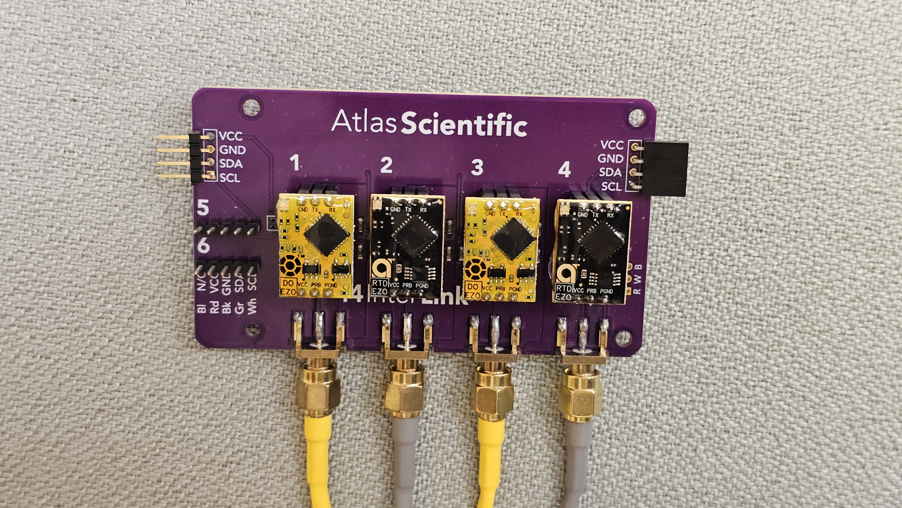
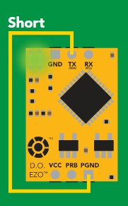
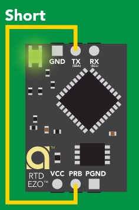
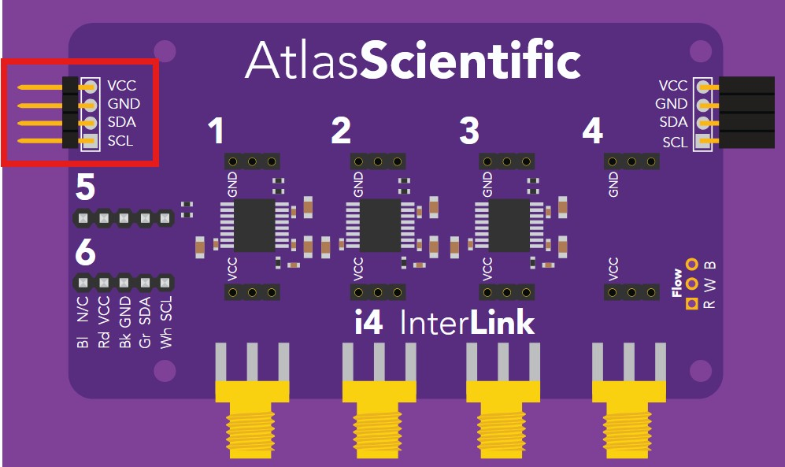

# Raspberry Pi based Atlas Scientific Sensor Logger #
---
Python Code and OS initilisation to configure a Raspberry Pi 3 B or Raspberry Pi Zero 2 W to periodically log sensor data from an Atlas Scientific i4 interLink connected to two Industrial DO/RTD Sensors.

This configures I2C communication with a DS3231 RTC and Relavent Atlas Scientific embedded circuits.
This configuration has been designed for the use of two industrial DO/RTD sensors connected onto an Atlas Scientific i4 inter Link carrier board.
---

## Sensor Configuration ##
The Industrial DO/RTD sensor connetects directly to the i4 interLink carrier board using the pre installed SMA connectors. Each sensor requires two EZO^TM^ Circuits to read the sensor data and provide interfacing. One circuit (EZO™ Dissolved Oxygen Circuit) reads dissolved oxygen probe, and another circuit (EZO™ RTD Temperature Circuit) reads the temperature probe.

By default the EZO^TM^ circuits operate in UART communication mode and so need to be manually configured to operate in I2C communication mode. 

Additionally the circuits come pre-programed with preprogramed I2C addresses which are the same accross the type of cicuit. So two connected DO circuits will have the same I2C addresses. This can be changed through the I2C communication interface, and so needs to be done before two industrial sensors are conencted to the same carrier board. Therefore one DO board and one RTD board per i4 carrier board needs to be configured with a differnt I2C address.

Instructions for this process is instructed here, however it is important to note that these instructions may become outdated.

### EZO™ Dissolved Oxygen Circuit ###

In order to configure the disolved oxygen circuit to communicate with the I2C protocol, the following procedure needs to be taken:
1. Disconnect all pins on the board from any connected device.
2. Connect the board TX pin to the PGND pin. Ensuring that the RX pin is not connected to anything.
3. Connect the VCC pin to a 3.3 or 5V source, then connect the GND pin to the source Ground.
4. Wait for the board LED to change from solid green to solid blue
5. You can now disconnect the VCC and GND Pins, then disconnect the TX and PGND pin.
6. The board is now ready for I2C Communication

In order to change the I2C address of the DO board, the following procedure needs to be taken:
1. Connect one of the DO circuits to the i4 carrier board 
2. Connect a configured Raspberry pi board to the relavent VCC, GND, SDA and SCL pins (How this connection is explained later). 
3. Through the terminal interface located in the same directory as the included AtlasI2C.py and i2c.py files, run the following command:
'sudo python i2c.py'
4. If the boards are connected correctly, text inteface listing commands should apear on the terminal.
5. Enter the command '97: I2C,98' This instructs the circuit to change its I2C address to 98 or 0x62 to prevent clashing with the second circuit. (The programmed address 98 can b altered to any other address that does not conflict with connected devices, however the accompanying AutomatedLogger.py code needs to be altered to use this address. By default the logger code uses the addresses 97, 98 for the two DO sensors and 102, 103 for the two RTD sensors)
6. At this point the i2c.py program can be stopped and the connected circuit should have a new I2C address. This can be checked re-running the same i2c.py program with the 'List' command to list the connected devices.
7. Keep track of the circuits which have been configured with a different address.

### EZO™ RTD Temperature Circuit ###

In order to configure the RTD temperature circuit to communicate with the I2C protocol, the following procedure needs to be taken:
1. Disconnect all pins on the board from any connected device.
2. Connect the board TX pin to the PRB pin. Ensuring that the RX pin is not connected to anything.
3. Connect the VCC pin to a 3.3 or 5V source, then connect the GND pin to the source Ground.
4. Wait for the board LED to change from solid green to solid blue
5. You can now disconnect the VCC and GND Pins, then disconnect the TX and PRB pin.
6. The board is now ready for I2C Communication

In order to change the I2C address of the RTD board, the following procedure needs to be taken:
1. Connect one of the RTD circuits to the i4 carrier board 
2. Connect a configured Raspberry pi board to the relavent VCC, GND, SDA and SCL pins (How this connection is explained later). 
3. Through the terminal interface located in the same directory as the included AtlasI2C.py and i2c.py files, run the following command:
'sudo python i2c.py'
4. If the boards are connected correctly, text inteface listing commands should apear on the terminal.
5. Enter the command '102: I2C,103' This instructs the circuit to change its I2C address to 103 or 0x67 to prevent clashing with the second circuit. (The programmed address 103 can b altered to any other address that does not conflict with connected devices, however the accompanying AutomatedLogger.py code needs to be altered to use this address. By default the logger code uses the addresses 97, 98 for the two DO sensors and 102, 103 for the two RTD sensors)
6. At this point the i2c.py program can be stopped and the connected circuit should have a new I2C address. This can be checked re-running the same i2c.py program with the 'List' command to list the connected devices.
7. Keep track of the circuits which have been configured with a different address.

---
## Raspberry Pi Configuration ##
The raspberry Pi needs to be configured to use the I2C interface, automatically run the logging program, and update and install drivers to use the real time clock. This is all performed by the two scripts init.sh and time_init.sh.

In order to connect the Raspberry Pi to the sensors and real time clock, the following connections must be made:
### Pi setup for Sensor configuration ###
1. 

### Raspberry Pi 3 B ###
1. Orient the board with the board with the USB ports directed towards you, and the pin headers on the right side.
2. Pin 1 (Top left pin) on the pin header is used to supply VCC (3.3V) to all conencted devices. Pin 3 (Directly Below Pin 1) is used for the SDA connection. Pin 5 is used for the SCL connection. Pin 6 is used for the GND or ground connection.
3. Connect the VCC, GND, SDA and SCL pins to the relavent pins on the DS3231 RTC board. 
4. Connect the VCC, GND, SDA and SCL pins on the RTC board to the relavent pins shown in the image below.
 
5. The Raspberry Pi, RTC module and i4 interLink carrier board should now be connected together and ready for operation.

### Raspberry Pi Zero 2 W ###
The connections for the Pi Zero 2 W are the same as for the Pi 3B. Ensure the Pin Header is on the right side of the board.
1. Using the Raspberry Pi Imager (https://www.raspberrypi.com/software/), Flash an SD Card with Raspberry Pi OS (32-bit) for the Raspberry Pi 3B (this will work with the Pi Zero 2W aswell)
2. Follow the onscreen instructions and use the following configuration: Hostname: "pi". Default Time zone configuration. Username: "pi", use a password of you choosing but keep note. Configure the wifi settings to conenct to your local wifi or hotspot. Enable SSH. Disable Pi Conenct.
3. Once the SD Card has finished flashing, it can be inserted into the Raspberry Pi.
4. With the Pi correctly wired to the RTC and i4 carrier board, and with only one sensor and the two ciruits (EZO DO and EZO RTD boards) connected. Connect power to the micro-usb port on the Raspberry Pi. (A Keyboard/Mouse HDMI display are recommended for set-up, otherwise an SSH conenction is required)
5. Copy the Files_to_Load folder onto a USB flash drive.
6. Once the Raspberry Pi has booted into the operating system, Connect the USB flash drive to the Pi and transfer the Files_to_Load folder onto the Pi.
7. Ensure the Pi is connected to the internet, then using the terminal located in the Files_to_Load folder, run the following command
'sudo raspi-config'
8. A screen interface will apear, Navigate to the Interfaces tab and then to the I2C tab.
9. Enable the I2C interface and once complete select the finish button.
10. Once back in the Terminal interface, the procedure mentioned earlier can be used to change the I2C address of bothe the connected DO and RTD circuits.

### Software Configuration ###
In order to correctly configure the Raspberry Pi with the relavent software, the following needs to be performed:
1. Using the Raspberry Pi Imager (https://www.raspberrypi.com/software/), Flash an SD Card with Raspberry Pi OS (32-bit) for the Raspberry Pi 3B (this will work with the Pi Zero 2W aswell)
2. Follow the onscreen instructions and use the following configuration: Hostname: "pi". Default Time zone configuration. Username: "pi", use a password of you choosing but keep note. Configure the wifi settings to conenct to your local wifi or hotspot. Enable SSH. Disable Pi Conenct.
3. Once the SD Card has finished flashing, it can be inserted into the Raspberry Pi.
4. With the Pi correctly wired to the RTC and i4 carrier board, and with the sensors and sensor circuits connected. Connect power to the micro-usb port on the Raspberry Pi. (A Keyboard/Mouse HDMI display are recommended for set-up, otherwise an SSH conenction is required)
5. Copy the Files_to_Load folder onto a USB flash drive.
6. Once the Raspberry Pi has booted into the operating system, Connect the USB flash drive to the Pi and transfer the Files_to_Load folder onto the Pi.
7. Ensure the Pi is connected to the internet, then using the terminal located in the Files_to_Load folder, run the following command
'bash init.sh'
8. Wait for the script to complete (this will be indicated on the terminal line).
9. Enter the following command 'sudo reboot'
10. Wait for the Raspberry Pi to reboot. 
11. Once Rebooted the system will automatically begin data logging and perform motor control.
12. In order to initilise the RTC to have the correct time, the following command can be run in a terminal located in the Files_to_Load folder.
'bash Time_Init.sh'
13. Follow the on screen instructions. This time initilisation process only needs to be performed if the RTC has not already been configured, and only needs to be run once.
14. The Pi is now set up and can be disconnected from power (Disconnect power only when the Sensors are not being read, this can be seen when the sensor LED's are not flashing). To perform the experiment, Connect power to the Pi and optionally connect a USB drive to the board. The system will automatically log sensor data every 20 seconds and store the files both locally and to the connected USB drive. When removing the USB drive, wait for a few seconds after a sensor read has been performed (once the sensor LED's turn off) then remove the USB.
